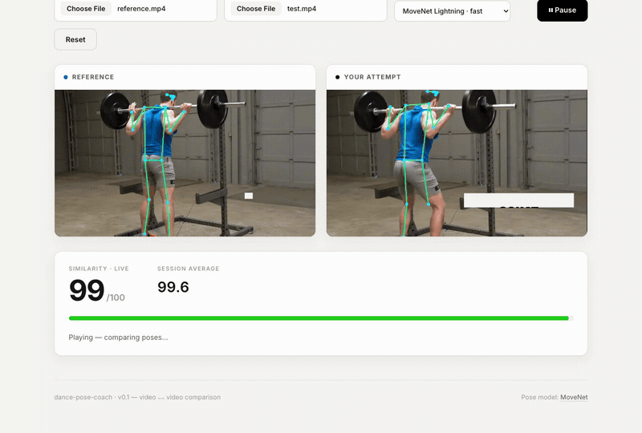

# dance-pose-coach

Video-vs-video dance pose comparison coach. Upload a **reference video** (the
"correct" choreography) and a **test video** (your attempt), play them side by
side, and get a real-time pose-similarity score driven by
[MoveNet](https://www.tensorflow.org/hub/tutorials/movenet) running entirely in
the browser via TensorFlow.js.

> **Status:** the v0.1 video ⟷ video core now also ships **webcam live-follow**,
> **DTW timeline alignment**, and a **per-limb divergence breakdown** (issues
> [#1](../../issues/1)–[#3](../../issues/3)), plus a **live score-history graph**,
> **streaming DTW for the webcam**, and **export of a scored comparison clip**
> (issues [#4](../../issues/4)–[#6](../../issues/6)). **v0.4** reworks the core:
> **viewpoint-robust strict scoring**, **3D Procrustes alignment**, and
> **sync-calibrated adaptive lag**. See [`tasks/todo.md`](tasks/todo.md).



> Demo footage derived from "Squat - exercise demonstration video" by
> FitnessScape, [CC BY 3.0](https://creativecommons.org/licenses/by/3.0). The
> right clip is the same movement zoomed + time-shifted. Under the **v0.4 strict
> scoring** the zoom is still ignored (3D-normalized), but the timing drift now
> genuinely pulls the score down — the run above settles around a ~74 average
> with live frames dipping into the 40s, instead of the old metric's near-100.
> Regenerate anytime with `npm run demo` — see [`demo/`](demo/).

## Features (v0.1)

1. **MoveNet detection** — 17 keypoints per frame; switch between
   `Lightning` (fast) and `Thunder` (accurate) at runtime.
2. **Skeleton overlay** — keypoints + bone edges drawn on a Canvas over each
   video (target ≥30fps on the Lightning model).
3. **Pose normalization** — hip-centered, torso-scaled so the score is
   invariant to where the dancer stands and how large they appear in frame.
4. **Cosine-similarity scoring** — per-frame similarity between reference and
   test poses, surfaced as a live 0–100 score plus a running average.
5. **Dual side-by-side playback** — both videos share a single play/pause and
   seek so frames stay aligned by playback progress.
6. **Runnable demo page** — no build step needed to try it; just `npm run dev`.

## Added since v0.1

7. **Webcam live-follow** (#1) — switch the test source from a file to the live
   camera (`getUserMedia`) and follow along against a reference routine in real
   time. The detection/scoring pipeline is identical; only the frame source
   changes. Falls back gracefully if permission is denied.
8. **DTW timeline alignment** (#2) — the **DTW align** button samples both clips
   into pose sequences and runs banded Dynamic Time Warping so a slower/faster
   attempt is matched to the reference *by pose* instead of by raw progress.
   Toggle off to return to linear alignment.
9. **Per-limb divergence breakdown** (#3) — a panel under the score ranks how far
   each limb (arms, legs, torso) is from the reference, and the worst-diverging
   limb is highlighted in red on the skeleton overlay so you know what to fix.
10. **Live score-history graph** (#4) — a sparkline in the scoreboard plots the
    similarity over the whole routine (raw per-frame + EMA-smoothed traces,
    hue-coded), so you can see *where* you drifted, not just the current number.
11. **Streaming DTW for the webcam** (#5) — in live mode the alignment button
    becomes **Live sync**: it matches your camera pose to the closest recent
    reference pose (lag compensation) so being a beat behind no longer tanks the
    score, and shows the measured lag in ms.
12. **Export a scored comparison clip** (#6) — **Export clip** records the
    side-by-side comparison (both skeletons + a score banner) entirely in the
    browser via `MediaRecorder` and downloads it as a `.webm` — no server.
13. **Export format MP4 / WebM** (#7) — a format picker beside **Export clip**
    chooses the container (default MP4, H.264; WebM uses VP9/VP8). Browsers that
    can't record MP4 (e.g. Firefox) fall back to WebM and say so, and the
    filename matches the container actually written.
14. **Multi-person video + dancer tracking** (#8) — a **People** toggle switches
    between *single-person* (the fast single-pose path) and *multi-person* mode,
    which runs MoveNet MultiPose and a light tracker (`pose/tracker.ts`) so the
    skeleton and score follow ONE dancer instead of flickering between bodies in
    a crowded frame. Click a body in **Your attempt** to lock onto it; the lock
    holds through brief occlusions/crossings and re-acquires the same person
    rather than snapping to a stranger. Only a fresh, locked match is scored.

## v0.4 — viewpoint-robust strict scoring

The original score was a cosine similarity over normalized **2D** coordinates,
which floored around ~75 for any upright human and stayed near 100 even for
visibly wrong poses. v0.4 reworks the comparison core:

13. **Strict joint-angle scoring** — `src/pose/similarity.ts` +
    `src/pose/boneAngles.ts`: similarity is now computed over **bone vectors /
    joint angles** and passed through an **exponential-decay curve** keyed to the
    mean joint error, so "very different" actually scores low. A **strictness
    slider** tunes how punishing the curve is (backward-compatible default).
14. **3D Procrustes alignment** — `src/pose/procrustes.ts` +
    `src/pose/detector.ts`: the detector can use **MediaPipe BlazePose GHUM**'s
    3D world landmarks, and the two poses are **Procrustes-aligned** into a
    shared, viewpoint-independent 3D canonical frame before scoring — so a
    different camera angle no longer corrupts the comparison.
15. **Sync-calibrated adaptive lag** — `src/pose/syncCalib.ts` +
    `src/pose/streamDtw.ts`: a one-time **countdown/clap calibration** estimates
    end-to-end **transport delay** separately from human reaction lag, and the
    streaming aligner adapts its `maxLagMs` from that estimate instead of a fixed
    cap. (Real clap-audio onset detection and true lens de-distortion are noted
    as optional follow-ups in [`tasks/todo.md`](tasks/todo.md).)

## Quick start

```bash
npm install
npm run dev      # opens http://localhost:5173
```

Then in the browser:

1. Pick a **Reference video** and a **Test video** (any `mp4`/`webm`/`mov`).
2. Choose the model (Lightning is the default; Thunder is more accurate but
   slower).
3. Press **Play** — both videos play together, skeletons overlay in real time,
   and the similarity score updates each frame.

### Build for production

```bash
npm run build    # type-checks then emits a static bundle to dist/
npm run preview  # serve the built bundle locally
```

## How scoring works

For each video frame we:

1. Run the detector (MoveNet 2D, or **BlazePose GHUM** for 3D world landmarks)
   to get per-keypoint `(x, y[, z], score)`.
2. Drop low-confidence keypoints, then **normalize**: hip-centered and
   torso-scaled, and — when 3D is available — **Procrustes-aligned** into a
   shared, viewpoint-independent canonical frame (v0.4).
3. Compare poses by **bone-vector / joint-angle** difference rather than raw
   coordinate cosine (v0.4), so the metric tracks limb articulation, not gross
   body shape.
4. Map the **mean joint error** through an **exponential-decay strict curve**
   (strictness slider) to a 0–100 score, so large deviations score genuinely low.

> Pre-v0.4 the score was a cosine over normalized 2D coordinates mapped
> `[-1, 1] → [0, 100]`; it floored near ~75 and rarely dropped, which is why the
> strict rework landed.

By default alignment is by **playback progress** (not content), so keep the two
clips roughly the same length and starting on the same beat. When tempos differ,
turn on **DTW align**: both clips are sampled into normalized-pose sequences and
matched frame-to-frame by pose distance `(1 − cosine)/2`, so the score reflects
*how* you moved rather than *when*. The **per-limb breakdown** then decomposes
the residual difference by body part.

## Tech stack

- **Vite** + **TypeScript** (ESM, no framework)
- **@tensorflow-models/pose-detection** (MoveNet)
- **@tensorflow/tfjs-backend-webgl** for GPU-accelerated inference

## Project layout

```
src/
  pose/
    detector.ts     # MoveNet + BlazePose GHUM (3D) wrapper, model switch
    normalize.ts    # hip-center + torso-scale (+ 3D normalization, v0.4)
    procrustes.ts   # 3D Procrustes alignment to a canonical frame (v0.4)
    boneAngles.ts   # bone-vector / joint-angle features (v0.4)
    similarity.ts   # joint-angle similarity + exponential strict curve (v0.4)
    syncCalib.ts    # transport-delay estimator for the live aligner (v0.4)
    dtw.ts          # banded DTW alignment over pose sequences (#2)
    streamDtw.ts    # streaming lag-compensated aligner for webcam (#5)
    perJoint.ts     # per-limb divergence + worst-limb tracking (#3)
    tracker.ts      # multi-person id tracking + single-target lock (#8)
    keypoints.ts    # COCO-17 names, skeleton edges, types
  render/
    skeleton.ts     # Canvas skeleton drawing (+ limb highlight)
  video/
    dualPlayer.ts    # synchronized two-video playback + frame pump (+ warp/live)
    sampler.ts       # offline pose sampling + warp builder for DTW (#2)
    webcam.ts        # getUserMedia capture for live-follow (#1)
  ui/
    app.ts           # wires DOM, detector, players, scoring together
  main.ts            # entry point
index.html
```

## License

MIT — see [LICENSE](LICENSE).
